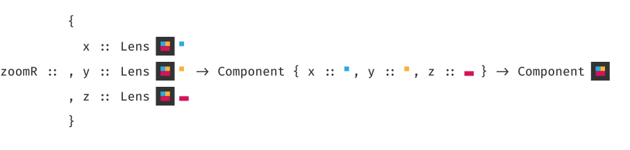
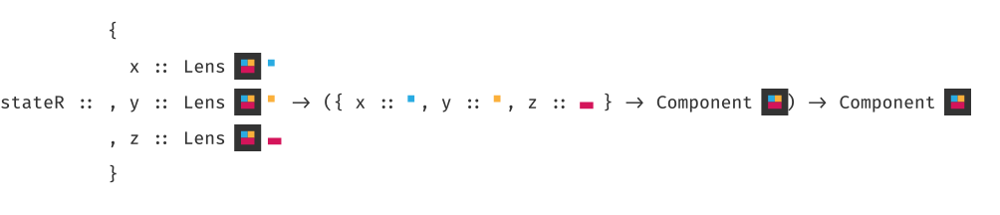
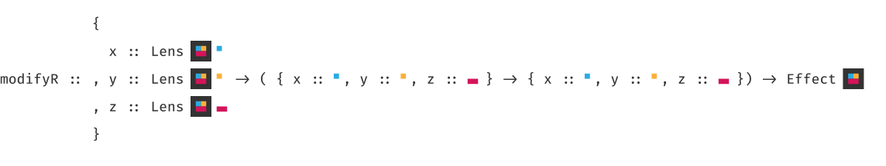
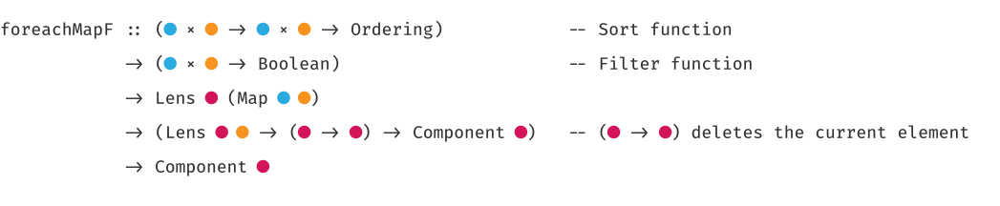

`purescript-refract` is an optical Purescript UI library based on React and the [Elm architecture](https://guide.elm-lang.org/architecture/), but without the boilerplate.

## Motivation

The Elm architecture is conceptually extremely simple:

* Define an `Event` type
* Define a function `Model -> View` (`Views` may fire `Events`)
* Define a fold function `Event -> Model -> Model`

Unfortunately, while straightforward, composition is verbose. Something as mundane as displaying the same component twice would force one to at least define a new `Event` constructor and adjust the fold function appropriately, forwarding sub events to the second component where needed. 

While other libraries solve that problem in various ways (e.g. [purescript-specular](https://github.com/restaumatic/purescript-specular)), they give up the conceptual simplicity of Elm's central `Model -> View` idea. `purescript-refract` tries to further explore the design space by retaining that simplicity while throwing away the boilerplate.

## Quick start

The canonical example of a counter in `purescript-refract`:

```purescript
counter :: ∀ eff. Component eff Int
counter = state \st -> div []
  [ div [ onClick \_ -> modify (_ - 1) ] [ text "Decrement" ]
  , text (show st)
  , div [ onClick \_ -> modify (_ + 1) ] [ text "Increment" ]
  ]
```

In short, skip the need to define an `Event` type and provide direct access to a component's state in its DOM event handlers. Composition happens through [lenses](https://github.com/purescript-contrib/purescript-profunctor-lenses); to focus on a specific sub-state, use [`zoom`](#zooming): 

```purescript
twoCounters :: ∀ eff. Component eff (Tuple Int Int)
twoCounters = div [] [ zoom _1 counter, zoom _2 counter ]
```

To render a list of components, each one focused on a single element, use one of the [`foreach*` combinators](#traversals):

```purescript
counters :: ∀ eff. Component eff (Array Int)
counters = div []
  [ div [ onClick \_ -> modify (cons 0) ] [ text "Add counter" ]
  , foreachZ _id counter
  ]
```

## Documentation

Module documentation is [published on Pursuit](http://pursuit.purescript.org/packages/purescript-refract).

## Full ToDoMVC example

To get a better idea of how `purescript-refract` code looks in the wild, check out the full ToDoMVC example - [Source](test/examples/ToDoMVC.purs) / [Demo](https://pkamenarsky.github.io/purescript-refract-todomvc).

## Components

A `Component eff st` is parameterized over an effect type `eff` and a state type `st` over which it operates.

All basic HTML building blocks are `Components`. For example, to construct a `span` within a `div`:

```purescript
spanWithinDiv :: ∀ eff st. Component eff st 
spanWithinDiv = div [] [ span [] [ text "Nested!" ] ]
```

## Accessing state

Having a `Component` with a state of type `Int`:

```purescript
intComponent :: ∀ eff. Component eff Int 
intComponent = div [] [ text "State: " ]
```

To access the `Component`'s state, use the `state` combinator:

```purescript
state :: ∀ eff st. (st -> Component eff st) -> Component eff st
```
In other words, `state` "reifies" the current `Component`'s state, e.g:

```purescript
intComponent :: ∀ eff. Component eff Int 
intComponent = state \st -> div [] [ text ("State: " <> show st) ]
```

## Modifying state and effects

Every HTML `Component` takes an array of `Props`, such as `onClick`:

```purescript
onClick :: ∀ eff st. (Event -> Effect eff st Unit) -> Props eff st
```

In turn, the following basic actions run in the `Effect eff st` monad:

```purescript
modify :: ∀ eff st. (st -> st) -> Effect eff st Unit
modify' :: ∀ eff st a. (st -> st × a) -> Effect eff st a
```

which modify the current `Component`'s state (and return a result in `modify'`'s case), and

```purescript
effectfully :: ∀ a eff st. (st -> Aff eff a) -> Effect eff st a
```

which embeds random `Aff eff` actions in `Effect eff st`. For example:

```purescript
div [ onClick \e -> do
        modify (_ + 1)
        effectfully \_ -> sendAjaxConfirmation
        modify (_ + 1)
    ]
```

## Composing components

Sometimes, a component needs to operate on different, not directly related substates of its parent. Imagine an input `Component` which only saves the typed text when the user presses the Enter key (and restores the original text if the Esc key pressed or a blur event is fired.)

There are two ways to define and reuse that `Component`:

* By concretely defining its state and zooming into it:
```purescript
inputComponent :: ∀ eff. Component eff { current :: String, input :: String }
```
* By keeping it polymorphic in its state and providing lenses to the different substates:
```purescript
inputComponent
  :: ∀ eff st.
     { current :: ALens' st String
     , input :: ALens' st String
     }
  -> Component eff st
```

### Zooming

Zooming may be a better choice if `{ current :: String, input :: String }` is a literal substate of the parent `Component`'s state:

```purescript
parentComponent
  :: ∀ eff. Component eff
  { inputState :: { current :: String, input :: String }
  , loggedIn :: Boolean
  }
parentComponent = div [] [ zoom inputState inputComponent ] -- assuming inputState is a Lens
```

`zoom` takes a `Lens'` from `st` to `stt`, a `Component` with a state of type `stt` and embeds it into a `Component` with a state of type `st`:


The new `RowToList` goodness allows for a `zoomR` combinator that works with generic records. Specializing to a concrete state, its type would be:



### Polymorphic components

Polymorphic components are more flexible and allow for easier [children-parent communication](#children-to-parent-communication) (though not impossible otherwise!)

```purescript
parentComponent
  :: ∀ eff. Component
  { current :: String
  , input :: String
  , loggedIn :: Boolean
  }
parentComponent = div []
  [ inputComponent { current, input }  -- assuming currentText and input are Lenses
  ]
```

This allows for easier mix-and-matching of various substates, if that is desired. Note that `parentComponent` here is _not_ a polymorphic `Component`!

### Accessing state in polymorphic `Component`s

To access polymorphic state use the `stateL` combinator:


Note that `stateL` keeps the `Component`'s state at `st`. For example:

```purescript
inputComponent focus =
  stateL focus.current \current ->
  stateL focus.input \input -> ...
```

Analogously to `zoomR`, there's `stateR` which works with generic records. Specializing to a concrete state, its type would be:



### Modifying state in polymorphic `Component`s

Analogously to `modify` and `stateL`, there is `modifyL` (as well as `modifyL'`): 


as well as `modifyR` and `modifyR'` (again, specialized to a concrete type):



## Children to parent communication

Sometimes a `Component` needs to alter its parent's state in some way (for example delete itself from a list.) One easy approach is to keep the `Component` polymorhpic in its state, use the `*L` or `*R` combinators and provide a state modifying function:

```purescript
inputComponent
  :: ∀ eff st.
      { current :: ALens' st String
      , input :: ALens' st String
      }
   -> (st -> st)
   -> Component eff st
inputComponent focus delete = div []
  [ div [ onClick \_ -> modifyR focus \st -> st { current = "" } ] [ text "Clear text" ]
  , div [ onClick \_ -> modify delete ] [ text "Delete" ]
  ] 

parent = div [] [ inputComponent { current, input }  ]
```

(Note that one could pass `Effect eff st Unit` instead of `st -> st` for an effectful action.)

Another approach is to specify the parent's state as part of the `Component`'s state and `zoomR` into the child `Component` from the parent `Component`:

```purescript
inputComponent
  :: ∀ eff st.
  -> (st -> st)
  -> Component eff
     { parent :: st
     , current :: String
     , input :: String
     }
inputComponent focus delete = div []
  [ div [ onClick \_ -> modify \st -> st { current = "" } ] [ text "Clear text" ]
  , div [ onClick \_ -> modify \st -> st { parent = delete st.parent } ] [ text "Delete" ]
  ] 

parent = div [] [ zoomR { parent: _id, current, input } inputComponent ] -- _id being the identity Lens'
```

### Unzooming

A combination of both approaches described above is to use `zoomUn*` to "unzoom" from the child `Component` into the parent `Component`:


For example:

```purescript
inputComponent
  :: ∀ eff st.
      { current :: ALens' st String
      , input :: ALens' st String
      }
  -> (st -> st)
  -> Component eff st
inputComponent focus delete = zoomR focus \unzoom -> div []
  [ div [ onClick \_ -> modify \st -> st { current = "" } ] [ text "Clear text" ]
  , unzoom $ div [ onClick \_ -> modify delete ] [ text "Delete" ]
  ] 

parent = div [] [ inputComponent { current, input }  ]
```

## Traversals

Currently there are traversal combinators for `Array`s and `Map`s. Each combinator is provided in a filtered or unfiltered, polymorphic, zoom + unzoom and zoom only variant.

For example, here's the polymorphic filtered `Map` traversal `foreachMapF`:



`Array` traversals:

| Filtered | Polymorphic | Zoom + Unzoom | Zoom only   |
|----------|-------------|---------------|-------------|
| **yes**  | `foreachF`  | `foreachUF`   | `foreachZF` |
| **no**   | `foreach`   | `foreachU`    | `foreachZ`  |

`Map` traversals:

| Filtered | Polymorphic    | Zoom + Unzoom  |
|----------|----------------|----------------|
| **yes**  | `foreachMapF`  | `foreachMapUF` |
| **no**   | `foreachMap`   | `foreachMapU`  |

The reason why only the `foreachMap*` variants provide an `st -> st` function that deletes the current focused element is that with arrays it's easy to run into the following situation:

``` purescript
div [ onClick \_ -> do
        modify delete
        modifyL focus \st -> st ...
    ]
    []
```

which would first delete the focused element and _only then_ attempt to modify it (in turn modifying the following element, if any, or resulting in a runtime error.) Since a `Map` is a one to one mapping of keys to values, attempting to modify an already deleted element will be a no-op and is thus safe.

## React bindings

`purescript-refract` is a thin wrapper over React and thus presents direct access to the lifetime methods API:

``` purescript
type Spec eff st =
  { displayName :: String

  , componentWillMount :: Effect eff st Unit
  , componentDidMount :: Effect eff st Unit
  , componentWillUnmount :: Effect eff st Unit

  , componentWillUpdate :: st -> Effect eff st Unit
  , componentDidUpdate :: st -> Effect eff st Unit

  , shouldComponentUpdate :: st -> Boolean
  }

componentClass :: ∀ eff st. Spec eff st -> Component eff st -> ComponentClass eff st

component :: ∀ eff st. ComponentClass eff st -> Component eff st
```

Note that `ComponentClass`es should be defined at the top level, otherwise every rerender will create a new `ComponentClass` and consequently force React to immediately and repeatedly call `componentWillMount`, `componentDidMount`, etc.

## Contributions

Comments, PRs, bug reports welcome.
